# API  
## Требования
Для запуска сервера необходимо установить:  
* nodejs
* пакеты: express, sqlite-json, js-md5, crypto

## Запуск API сервера из папки **APIServer**:  
`node server.js`
## Использование
API используется посредством **GET**, **POST**, **PUT** или **DELETE** запросов по адресу сервера  
Для выполнения запросов необходимо получить токен:  
`POST http://localhost/authorization?passportid=123456&password=1234`  

**Пример ответ:**  
```json
{
    "token": "7d3ecb26b266576b352b00bfd36a8484"
}
```

Дальнейшие запросы выполняются через выданный токен, который указывается с помощью header ключа `token`.  
Полный список запросов доступен в документации API

# Библиотека **DryCleaningAPI**
Библиотека предоставляет объектную модель по взаимодействие с API сервером  
## Авторизация
По логину и паролю (будет создана сессия с токеном)  
```csharp
var dryCleaningClient = new DryCleaningAPI.DryCleaningClient("http://localhost", 1234, "password");
```

или если токен уже известен  
```csharp
var dryCleaningClient = new DryCleaningAPI.DryCleaningClient("8cd7fde10d6dbad74c13a809a1aea0c4");
```

в `dryCleaningClient` будут созданы следующие экземпляры классов:  

## Использование  
| **Класс** | **Описание** |
| ------ | ------ |
| `ChemicalAgentClient`  | Химические средства |
| `CleaningOrdersClient` | Заказы |
| `ClientsClient` | Клиенты |
| `MaterialsClient` | Материалы |
| `ResultsClient` | Результаты |
| `RolesClient` | Должности |
| `TypesClient` | Типы вещей |
| `UsersClient` | Сотрудники |
| `ThingsClient` | Вещи |
| `CleaningsClient` | Чистки |

У каждого из которых есть такие методы, как `Get`, `Add`, `Edit`, `Delete` и т.п.

# Приложение для сотрудников DryCleaningClient
## Требования
* ОС Windows
* .NET Framework >4.8
* ObjectListView 2.9.1
* Newtonsoft.Json 12.0.3
## Авторизация
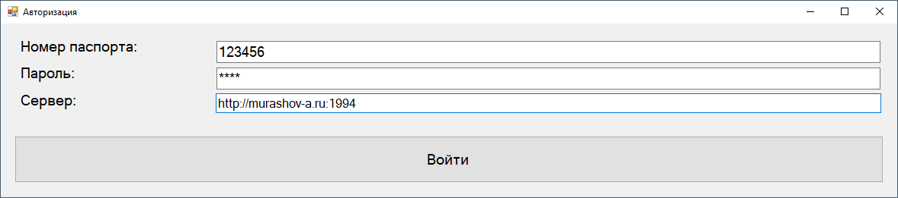
## Главная форма
[НА СТАДИИ РАЗРАБОТКИ]
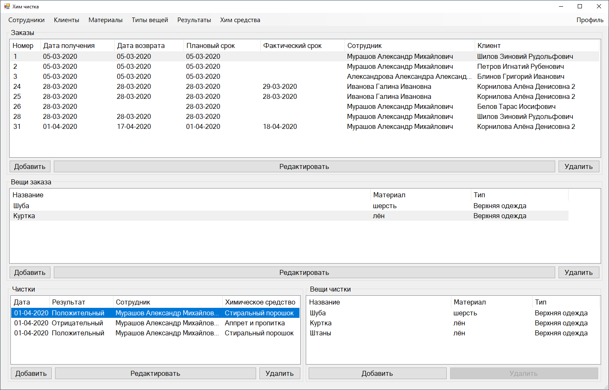
## Химические средства
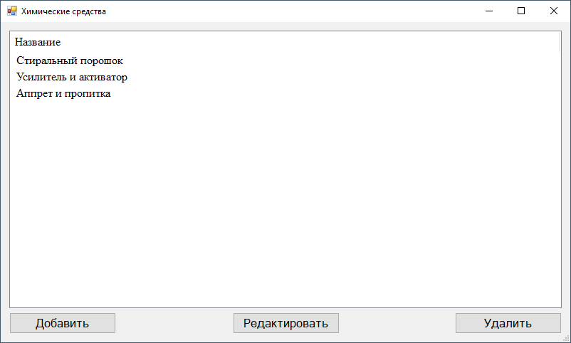
## Клиенты
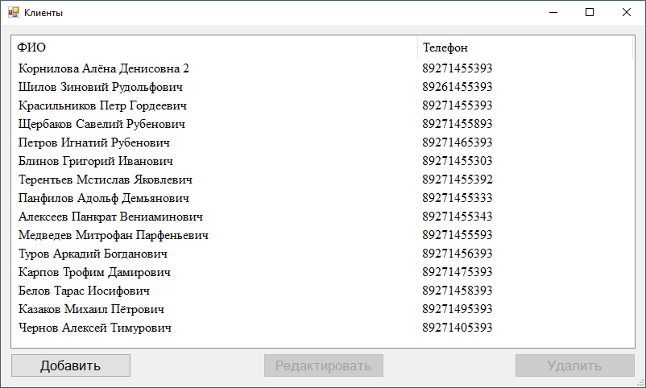
## Материалы
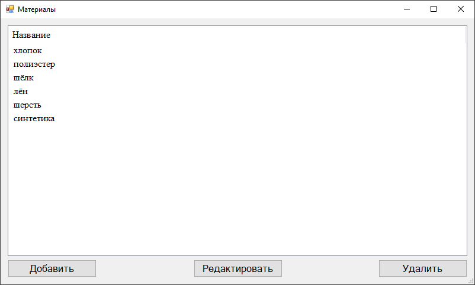
## Меню сотрудника
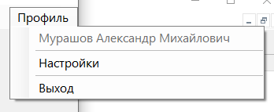
## Редактирование профиля сотрудника
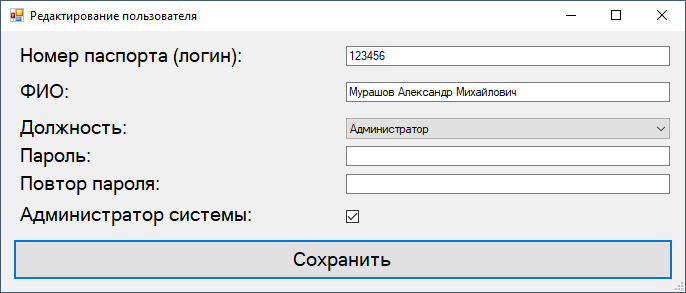
## Результаты чистки
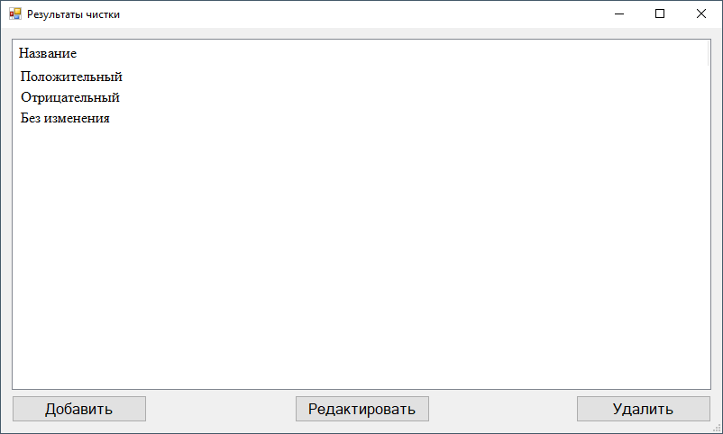
## Должности
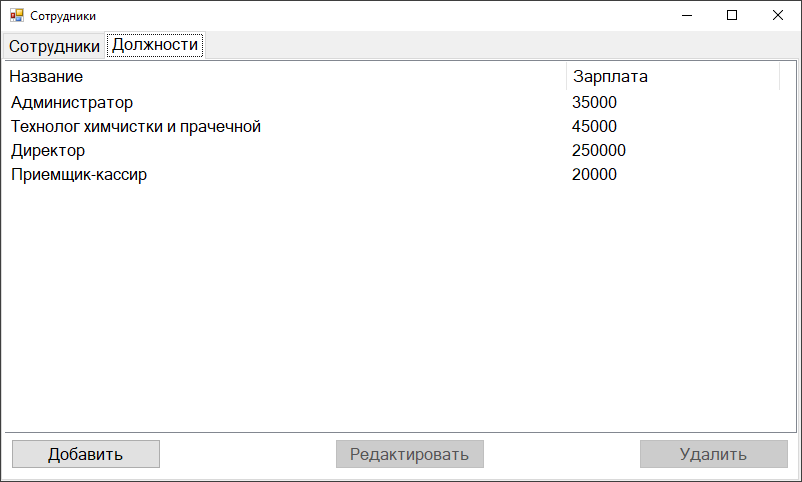
## Типы вещей
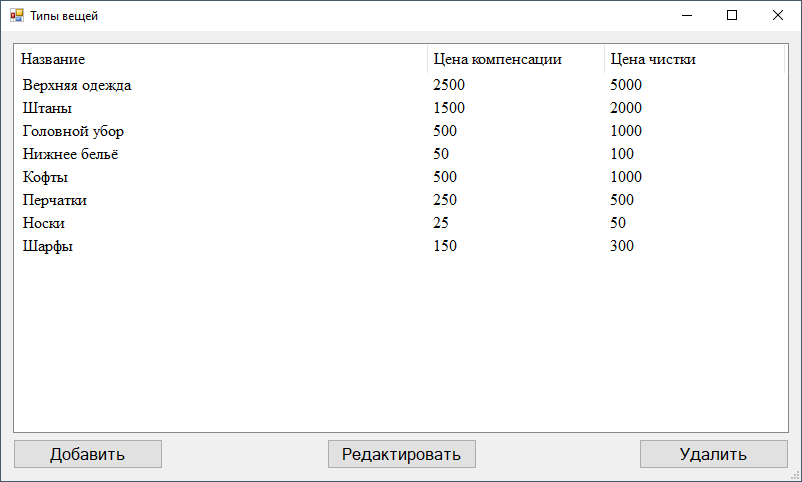
## Сотрудники
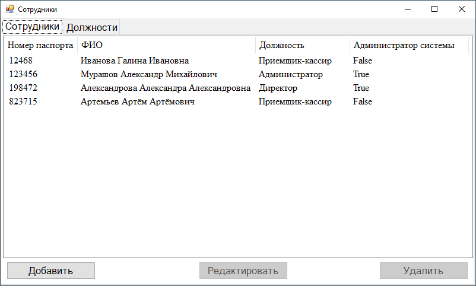

Для каждого элемента существует форма редактирования/добавления. Пример на следующем скрине:  
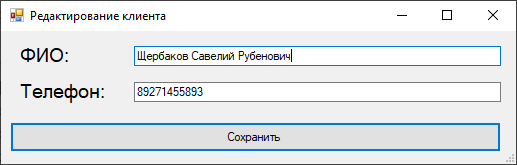